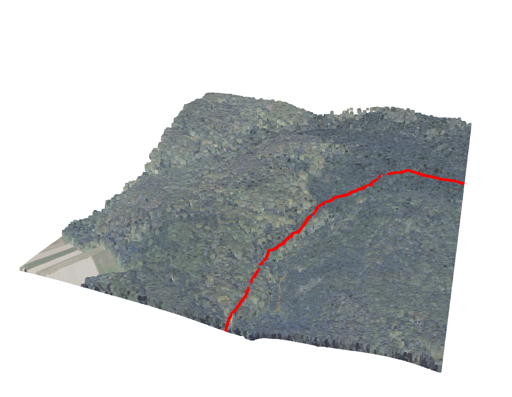

# GPX Visualizer 3D
[](https://github.com/hawier-dev/gpx_visualizer_3d "Go to GitHub repo")

Python script to visualize gpx tracks on a point cloud.

## Screenshot



## Usage:

To use this tool you need to provide `.gpx` and optionally `.las` file

Available command line arguments:

| Name        | Description                                                                                                              | Default   | 
|-------------|--------------------------------------------------------------------------------------------------------------------------|-----------|
| --path_gpx  | Path to gpx file                                                                                                         |           |
| --path_las  | Path to LAS(LASer) file                                                                                                  | None      |
| --color     | Color of the GPS track in rgb (`"r g b"`)                                                                                  | "255 0 0" |
| --top       | The value by which to increase Z. In some cases, <br/> it should increase visibility of the track on the <br/> `.las` file | 0         |

```shell
python visualize.py --path_gpx {PATH_TO_GPX} --path_las {PATH_TO_LAS_FILE} --color "r g b" --top 0
```

